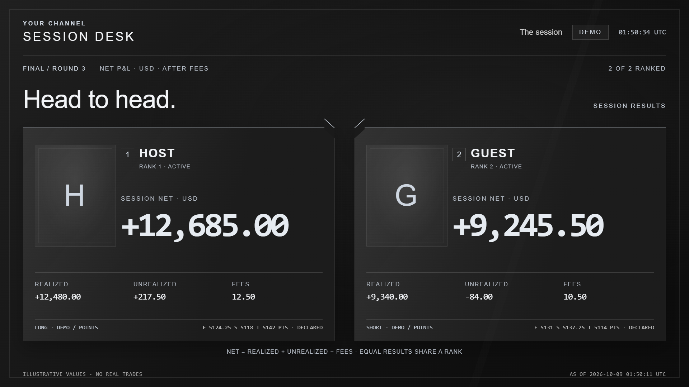

# OBS Director MCP

**Control OBS Studio from an MCP client. Use cues for repeatable changes.**

OBS Director connects an MCP client to OBS Studio on the same computer.
The client can send individual commands or a cue with several steps.
Local code validates the cue, controls the step sequence, and records the results.

This original project uses the [MIT license](LICENSE). This version is an alpha.
The public repository is
[rustybladerunner/obs-director-mcp](https://github.com/rustybladerunner/obs-director-mcp).
Download release files from [GitHub Releases](https://github.com/rustybladerunner/obs-director-mcp/releases).
Package-registry publication is not part of this alpha.

## What it does

| Area | Functions |
| --- | --- |
| Scenes | Read scene names. Create scenes. Select the program scene or the preview scene. |
| Sources | Add inputs. Change settings, visibility, position, crop, and scale. |
| Layouts | Preview and apply a complete recipe with existing inputs, local images, colors, borders, and item order. Repeated application reuses matching items. |
| Templates | Copy the editable light or dark Funded Desk template, original artwork, and image prompts into a new local folder. |
| Audio | Set the mute state and volume. |
| Filters | Read filter names. Enable filters. Change settings of existing filters. |
| Media | Play, pause, stop, start again, and seek. Next/previous commands have limited result verification. |
| Transitions | Inspect and select existing transitions. Configure an already-selected native stinger from a local clip. |
| Complete show | Render Starting Soon, a tournament table, standings, replay, break, and ending scenes from a bounded synthetic or paper snapshot. |
| Outputs | Control the stream, replay buffer, and virtual camera through a separate tool. |
| Capture | Record a session. Save local frame measurements and hashes of completed files. |
| Director cues | Validate all steps before execution. Record completed, failed, and skipped steps. |
| Events | Select a locally registered cue from a production event. Reject duplicate execution within the current process. |

Tools that change OBS use a dry run by default. A dry run returns a plan without changes to OBS.
It is different from the OBS preview scene. The [glossary](docs/TERMINOLOGY.md) defines both terms.

If recording or streaming is active, set `allow_live=true` for production changes.
To execute a change, also set `dry_run=false`.
Output start/stop commands need `OBS_MCP_ALLOW_OUTPUT_CONTROL=1` in the local environment.
The server does not start a stream at startup. Cues cannot start a stream.

## Quick start

Start with the [neutral six-scene starter](docs/STARTER.md), or choose the
[PipHound showcase](docs/SHOW-DEMO.md) for a finished example with large trader
cards, original artwork, a layered stinger and an [original audio pack](docs/AUDIO.md).
Optional [PipHound reactions](docs/REACTIONS.md) add transparent puppet clips with
original barks and captions.
Optional [motion loops](docs/MOTION.md) add gold Fibonacci drawings, drifting
candlestick forms and poker geometry to the intermission scenes.
Both use the same snapshot contract and director. Copy a template into your own
show folder; keep credentials, account connections and personal data outside Git.

| Neutral starter | PipHound showcase |
| --- | --- |
|  |  |

These previews show synthetic demo data captured from OBS.

For the copyable layout, see [Templates](docs/TEMPLATES.md). The `funded-desk`
template uses an original ivory, black, and gold theme informed by TradeFunded's
visual style. It includes no brand logo and has no affiliation with TradeFunded.
Templates need explicit bindings to your existing OBS inputs before application.
`obs_preview_layout` checks the complete recipe and OBS state before any changes.
`obs_apply_layout` uses a dry run by default and never selects the program scene
or starts an output. Layout changes are verified, but are not atomic: a failure
can leave completed changes in place. The receipt identifies partial progress.

The [Funded Desk stream demo](docs/STREAM-DEMO.md) exercises the template with
PipHound, synthetic charts, and a loopback-only RTMP receiver. It requires an
explicit `--execute` command and restores the original OBS selection afterward.
Choose a framed or transparent PipHound presenter. The demo also exercises signed
[P&L displays](docs/PNL.md) and [audience alerts](docs/AUDIENCE.md).
The audience adapter accepts synthetic or caller-supplied projections. Twitch and
YouTube authentication and event ingestion are separate work, not included here.

The [complete tournament show](docs/SHOW-DEMO.md) includes opposing trader cards,
large signed net P&L, declared standings rules, and a reusable alpha stinger.
It runs as a 42-second loopback rehearsal. Music plays only during intermissions.
Major segment changes use the stinger; routine changes use a short dissolve.
The sample replay is an illustration,
not a captured trade. This source-checkout example has no broker connection.
Its [snapshot contract](docs/TOURNAMENT.md) keeps missing and stale entries unranked.
The [transition tools](docs/TRANSITIONS.md) use native OBS transitions that already
exist. The complete show demonstrates a shared media overlay stinger.

Agents can use the repo-owned [layout design skill](.agents/skills/obs-layout-design/SKILL.md)
and [tournament broadcast skill](.agents/skills/obs-tournament-broadcast/SKILL.md).
The editable examples, skills and demo tools ship in the source archive;
the wheel contains the MCP server and the Funded Desk template assets.

Python 3.11 or later and OBS WebSocket v5 are necessary.
Session recording also uses the recording-directory requests from WebSocket 5.3.

1. Open **Tools → WebSocket Server Settings** in OBS.
2. Enable the WebSocket server.
3. Keep authentication enabled.
4. Install the package from a source checkout:

   ```sh
   python -m pip install -e .
   ```

5. Start the MCP server:

   ```sh
   python run_server.py
   ```

You can also use the installed `obs-director-mcp` command.
Both commands use MCP over standard input and output (`stdio`). They do not start an HTTP server.
Standard output contains only MCP messages.

To let an MCP client start the server, use its server configuration.
Replace the interpreter and checkout paths in this example:

```json
{
  "mcpServers": {
    "obs-director": {
      "command": "python",
      "args": ["/path/to/obs-mcp/run_server.py"]
    }
  }
}
```

The server reads the password from `OBS_MCP_PASSWORD` or the local OBS WebSocket configuration.
The release files must not contain these credentials. The server connects only through the loopback address.

| Environment variable | Function |
| --- | --- |
| `OBS_MCP_PORT` | Override the OBS WebSocket port. The default is the OBS configuration value, or 4455. |
| `OBS_MCP_PASSWORD` | Supply the OBS WebSocket password. |
| `OBS_MCP_CONFIG` | Select a local OBS WebSocket configuration file. |
| `OBS_MCP_DATA_DIR` | Select the local directory for server state. |
| `OBS_MCP_EVIDENCE_ROOT` | Select the local directory for capture evidence. |
| `OBS_MCP_ALLOW_OUTPUT_CONTROL` | Set to `1` to permit output start/stop commands. |
| `OBS_MCP_EVENT_ROUTES` | Select an absolute path to a local event-route JSON file. Without this setting, no event routes exist. |

Refer to [Security and private data](docs/SECURITY.md) before live operation.

## Cues

The [examples](examples/) contain cues as data files. A cue has 1 to 20 steps.
The total of its explicit waits must not exceed 15 seconds.
Network delays and OBS processing can increase the total execution time.

1. Change the example scene and source names to match your OBS collection.
2. If recording and streaming are inactive, use `obs_validate_cue` to validate the complete cue against the current OBS state.
3. If recording or streaming is active, use `obs_run_cue` with `dry_run=true` and `allow_live=true` to validate the cue.
4. Examine the plan before execution.
5. If recording and streaming are inactive, call `obs_run_cue` with `dry_run=false` to execute the cue.
6. If recording or streaming is active, call `obs_run_cue` with `dry_run=false` and `allow_live=true` to execute the cue.

Both validation tools examine the complete cue. `obs_validate_cue` does not accept permission for live changes.

The server validates every step before the first change. A cue cannot contain arbitrary commands, scripts, or stream-start steps.
Cue changes to source settings contain text only, with a maximum of 4096 characters.
Individual source tools have a different settings interface.

If an OBS command or its result check fails, the server stops the cue.
The result identifies completed, failed, and skipped steps. The server does not reverse earlier changes.
A failed command can leave its change in effect. OBS control results do not prove correct picture or audio.

OBS remains available to other controllers during a cue. Validation does not lock OBS against those controllers.

For an OBS FFmpeg media source, put the visibility step before the restart step.
The server waits for the source to be showing before it sends the restart command.

## Production events

An event selects a cue from a local route registry. Event payloads cannot select arbitrary actions, paths, or scenes.
The optional route file uses schema `obs.event-routes.v1`. It can contain up to 16 routes and must not exceed 128 KiB.
Each route contains a cue. An optional `text_step` selects a text-only source-settings step within that cue.

The event schema is `obs.event.v1`. Event identifiers and event types contain 1 to 96 permitted identifier characters.
`occurred_at` contains a UTC timestamp with a final `Z`. The timestamp does not schedule execution or prove freshness.
The payload has three plain-text fields: `title` (80 characters), `summary` (240 characters), and `reference` (96 characters).
These fields cannot contain control characters.

1. Use `obs_preview_event` to read the cue plan for an event.
2. Examine the plan and the current OBS state.
3. To execute the event, call `obs_dispatch_event` with `dry_run=false`.

If recording or streaming is active, both event calls also need `allow_live=true`.
A preview does not consume an event identifier.
The server keeps up to 1024 consumed event identifiers in process memory. It refuses new identifiers when this capacity is full.
After successful validation, an execution attempt consumes its identifier even if execution fails or its result is uncertain.
The server rejects different content with a previously consumed identifier.
The server loses this record when it restarts. A producer needs its own persistent record to prevent execution after a restart.

The [synthetic demo](docs/DEMO.md) explains local routes, event data, and the rehearsal command.
OBS command results alone do not establish visual or audio acceptance for that demo.

## Useful directions

- A cue can show a replay, change the layout, and set the audio volume.
- A presentation cue can enlarge one source and hide secondary panels.
- A local application can use production events to select a cue.
- A separate browser overlay can add animation, annotations, and audience graphics.

Browser-overlay rendering, speech recognition, and streaming-platform chat are separate integrations.
This package supplies production controls. It does not interpret chart content or supply a streaming account.

## Capture evidence

Capture tools keep screenshots and recordings on the local computer.
Tool results contain paths, hashes, times, and measurements. They do not contain screenshot pixels.
`obs_capture_health` writes local files when it takes its samples.

A near-black frame can indicate a capture problem. An unchanged frame can be a correct picture of a static slide.
Frame measurements do not prove correct content, motion, or audio.
A completed file and its hash do not prove those properties either.

Session recording starts only when OBS is neither recording nor streaming.
The adapter keeps the live connection and recording events for its own session.
To stop that recording through the adapter, use the original process and connection.

The adapter waits for recording events and matching output state, with a 10-second limit.
If a start remains uncertain, it keeps the capture marked `may_be_recording`.
It preserves the recording directory and refuses another recording in that evidence root.
Examine OBS and the local capture manifest before recovery. The adapter does not clear this uncertainty automatically.

If the process restarts or loses recording ownership, examine OBS and stop the recording in OBS itself.
OBS cannot compare a recording identifier and stop that recording in one atomic operation.
Do not make simultaneous manual recording changes while the adapter owns a session.

## Cinematic opening

The source checkout and source archive include an original 24-second
[PipHound simulation intro](examples/cinematic-intro/README.md). It uses local
Three.js assets, a dark gold palette, and an optional soundtrack. The original
score is still pending; the included opening plays silently. See the
[show setup](docs/SHOW-DEMO.md#cinematic-opening) for OBS instructions.

## Development and release checks

Run these commands from the source checkout:

```sh
python -m unittest discover -s tests -v
python tools/public_check.py
python tools/smoke.py
python tools/smoke.py --live
python tools/build_release.py
python tools/verify_dist.py
```

The smoke test starts a real MCP SDK subprocess. Its default mode tests the result when OBS is disconnected.
The `--live` mode reads only OBS status and capabilities.
Tests with synthetic clients exercise changes without a live production.
Git excludes local test evidence and generated packages.

To test an installed package, install the built wheel into a separate environment first.
Then run `python tools/smoke.py --installed --python <consumer-interpreter>` with that environment's interpreter path.
This mode starts the installed command outside the checkout and rejects an import from the checkout's source directory.
The distribution check compares both archives with the source, metadata, expected file lists, and public-content rules.

Before release, examine the exported files and dependency licenses.
Run the public-content check against the release source.
The scanner can miss private information. A passing result is not proof that every file is suitable for publication.

The [documentation review](docs/STE-REVIEW.md) records the scope of the technical-English review and its remaining limits.

## Implementation provenance

The implementation uses the [official OBS WebSocket protocol](https://github.com/obsproject/obs-websocket/blob/master/docs/generated/protocol.md)
and the [Python MCP SDK](https://github.com/modelcontextprotocol/python-sdk).
An earlier internal capture prototype supplied the transport and recording-ownership design.
The development record identifies that prototype by its source hash.
This repository has no dependency on the original application.

The feature review included [aaronckj/obs-studio-mcp](https://github.com/aaronckj/obs-studio-mcp)
and [royshil/obs-mcp](https://github.com/royshil/obs-mcp).
This project contains no copied source from either repository.
Dependencies keep their own licenses. The [MIT license](LICENSE) applies to the original source in this project.
