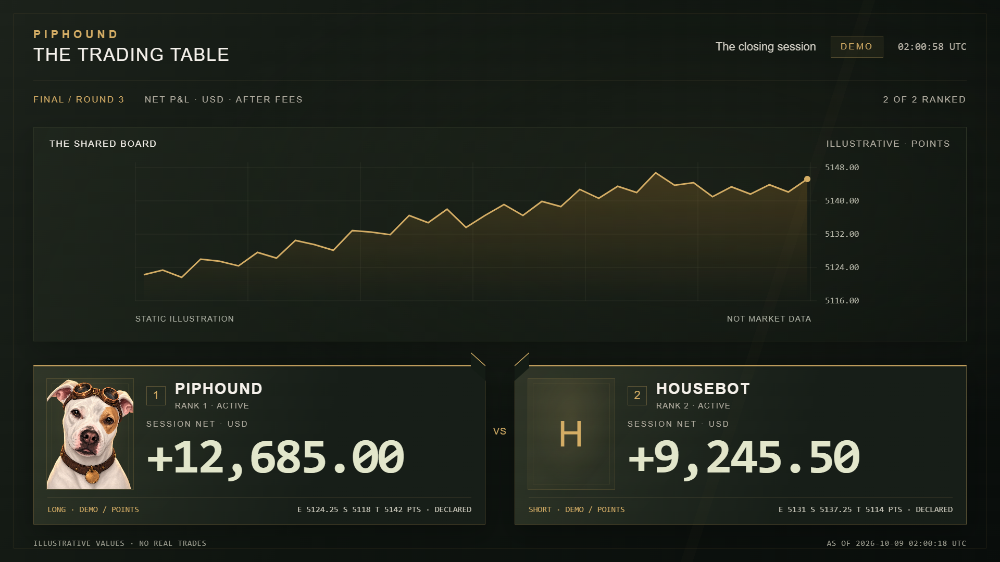

# Complete tournament show

This original example uses the Funded Desk dark palette and a transparent
PipHound portrait. It includes Starting Soon, the live table, standings, an
illustrative replay, a break screen and Stream Ending. The local rehearsal
returns to the table before the ending scene.



Each table card gives the signed net P&L the largest type. Realized P&L, open
P&L, fees, instrument, direction and entry/stop/target values remain distinct.
Standings use one session and one currency. Missing and stale entries are
unranked. See the [snapshot contract](TOURNAMENT.md).

## Render editable scenes

Run from a source checkout. The output parent must exist. The output directory
must be new. `--demo` creates fresh, explicitly synthetic values.

```sh
python tools/render_tournament.py --demo --template piphound --output runtime/show-scenes
```

The result contains six HTML pages, local CSS and JavaScript, the portrait,
the snapshot and a hash manifest. It makes no OBS or network connection.
To display caller-supplied paper data, use `--snapshot path/to/snapshot.json`
instead of `--demo`. Rendering does not authenticate the data source.

## Rehearse through OBS

OBS must be open, its WebSocket server must be enabled, and all outputs must be
idle. FFmpeg must be available. Review this offline plan first:

```sh
python tools/tournament_demo.py --assets-directory runtime/show-scenes --stinger examples/tournament/piphound-stinger-deluxe.webm --audio-directory examples/tournament/audio --output runtime/show-take
```

Add `--execute` to run the 42-second rehearsal. Add `--ffmpeg path/to/ffmpeg`
when FFmpeg is not on PATH. The helper creates an isolated profile and scene
collection, mutes system audio and sends the show to its fixed loopback RTMP
receiver. Starting Soon, Break and Ending use the original instrumental loop.
The table, standings and replay have no background music. It accepts no public destination. It
restores the original profile, collection, scene and video settings afterward.

Add `--reactions-directory examples/tournament/reactions` to include three
[PipHound puppet reactions](REACTIONS.md). This extends the rehearsal to 56
seconds. The clips appear over the board during the first table view, replay
and break. Use `--reaction-volume-db` to set their independent level between
-60 and 0 dB; the default is -6 dB. The clips use whole-cutout movement and
original nonverbal woofs. They do not animate an articulated speaking mouth.

The new output folder holds the receiver recording, scene screenshots, receipts
and restoration result. These files are private runtime evidence, not source
assets. Preserve a failed run when diagnosing a later run. If stream ownership
or restoration is unproven, the helper stops with an explicit error.

## Stinger

The included 1920 by 1080, 30 fps WebM clips have alpha transparency. The deluxe
clip assembles staggered charcoal panels, gold card edges, market motifs and an
original PipHound emblem, then opens onto the next scene. The simpler classic
clip remains available. No poker broadcast assets were copied. Adjacent JSON
files give their hashes and timing contracts.

The example uses one shared media input across scenes. It verifies playback,
switches near 1100 ms inside the deluxe clip's 700–2066 ms opaque window, checks the cursor
after the switch, and hides the overlay after the transparent tail. A missed
window is an error, not a late cut or an automatic retry. The helper establishes
a stopped media state before each restart to make playback verification clear.

This is an **overlay stinger**. Native OBS stingers must already exist before
the MCP can select and configure them. See [native transitions](TRANSITIONS.md).
The demo uses three major stinger changes and three 300 ms routine dissolves.
The classic clip retains its 900 ms cut inside a 500–1733 ms opaque window.

With `--audio-directory`, the helper verifies the audio manifest and muxes the
original effect onto a private runtime copy of the deluxe video. Picture and
effect then use one playback clock. The video is copied without recompression.
The stinger's OBS level is -6 dB and each music input is -8 dB. Adjust them
independently. Without this option the rehearsal is silent. See [Audio](AUDIO.md).

To generate a new copy, supply an installed font file and a new output path:

```sh
python tools/build_stinger.py --font-file path/to/font.ttf --output runtime/my-stinger.webm
```

Add `--style deluxe --emblem examples/tournament/piphound-emblem.png` for the
layered version. The [neutral starter](STARTER.md) uses the same director and
snapshot contract and needs no mascot artwork.

The generator uses lossless VP9 to preserve the opaque hold and transparent
endpoints. It refuses to overwrite the video or its JSON sidecar. Rebuilding
with another font or FFmpeg build can change the file hash. Check decoded alpha
and actual OBS footage before using the resulting clip on a public stream.

## Limits

- All demo results and chart movement are synthetic. The replay is labelled
  illustrative. The intermission screens have no promised countdown.
- No account, broker, platform subscription or prize system is connected.
- The receiver uses 1280 by 720 output from a 1920 by 1080 base canvas.
- Source and cursor readback do not prove rendered pixels. Inspect the recording.
- Native stinger creation is outside the WebSocket v5 request set.
